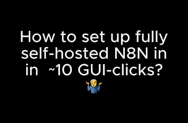
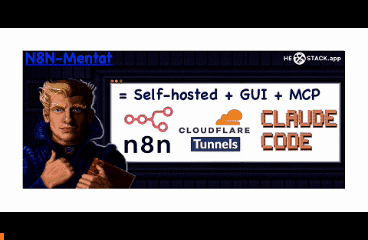
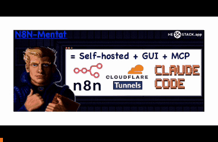

# N8N-Mentat: self-hosted local N8N running out-of-box, with GUI, cloudflare tunnel exposure to domain and claude code MCP-server

| Features implemented | Pains solved | Version |
|------|------|-----|
| Run self-hosted N8N locally as GUI app with zero setup |     | 🆓 |
| No-docker cross-platform GUI runner for self-hosted N8N |     | 🆓 |
| Serve self-hosted N8N on domain via tunnel without VPS or exposure risks |  | 🆓 |
| Automate N8N flows development with AI MCP / AI Agent in claude code |   | 🌟 |

⠀⠀

## Features
| **🆓FREE:** Get started when just opened app! Single GUI, single app window. Data stored locally |  |
|------|------|
| **🌟PRO:** Expose the local running N8N to your domain via Cloudflare tunnel in 3-clicks in GUI |  |
| **🌟PRO:** Setup and run ready-to-use MCP server & custom command for Your Claude code in 2 clicks in GUI with prepared integration to build automating workflows |  |

## TLDR;

### Features description

#### 🆓 Free

**N8N Localhost** — Run n8n locally with zero setup
- One-click launch of self-hosted n8n — no Docker, no VPS, no terminal
- Built-in n8n web UI embedded directly in the app
- Auto-starts n8n server on localhost:5678
- Data persists locally between sessions
- Works on macOS, Windows, and Linux
- Community edition — free and open-source n8n engine

**FAQ** — Quick reference
- n8n licensing explained (community vs enterprise)
- How to activate enterprise features
- Troubleshooting common issues

#### 🌟 PRO

**Cloudflare Tunnel** — Expose n8n to the internet securely
- 4-step guided tunnel setup wizard
- Install cloudflared directly from the app
- Authenticate with Cloudflare account
- Create named tunnel with custom domain
- Start/stop tunnel on demand — no port forwarding, no static IP
- Webhooks and external integrations just work

**Claude Code MCP** — AI-powered n8n workflow development
- Install n8n MCP server for Claude Code with one click
- Install n8n Skills pack (pre-built Claude commands for n8n)
- Start/stop MCP server process from the app
- Embedded Claude Code terminal with `/mentat-n8na` command
- Optional skip permissions mode for faster AI iteration
- AI reads your n8n setup context and builds workflows

### Tech stack
* <a target="_blank" href="https://github.com/electron/electron"> Electron</a>
* <a target="_blank" href="https://github.com/n8n-io/n8n"> n8n</a>
* <a target="_blank" href="https://github.com/nodejs/node"> Node.js</a>
* <a target="_blank" href="https://github.com/xtermjs/xterm.js"> xterm.js</a>
* <a target="_blank" href="https://github.com/cloudflare/cloudflared"> Cloudflare Tunnel</a>
* <a target="_blank" href="https://github.com/anthropics/claude-code"> Claude Code MCP</a>

### Download at itch.io

